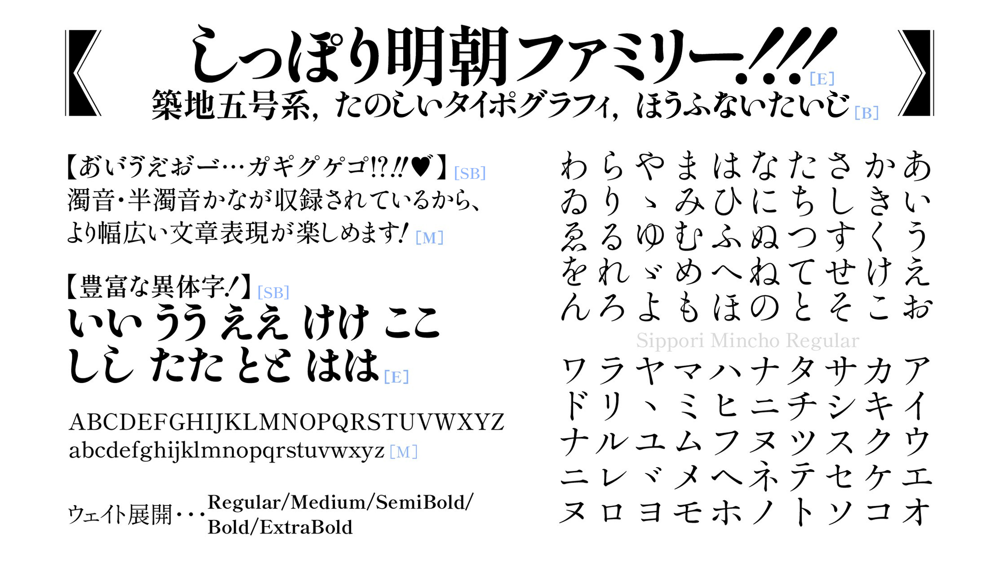
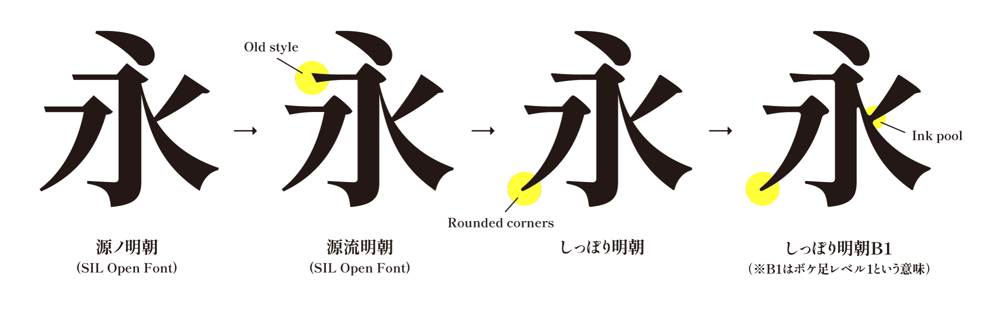
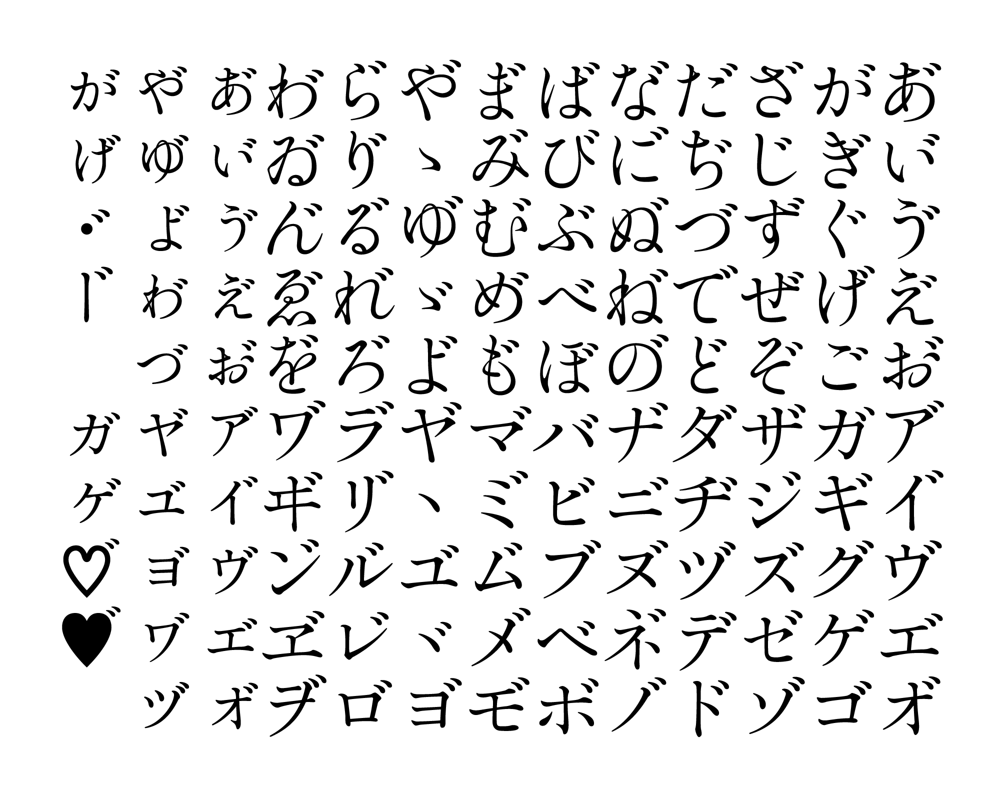
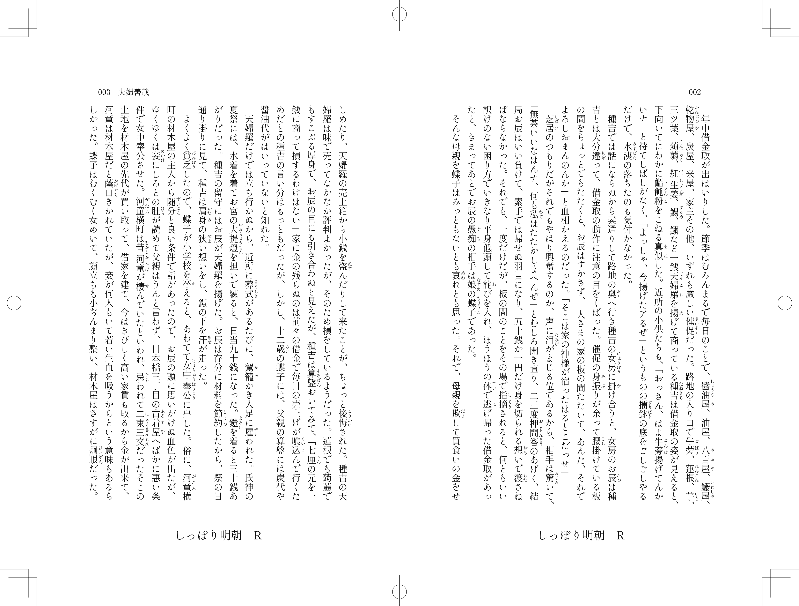

<h2>はじめに</h2>
こちらは今後GoogleFontsに提供するフォントです。 
品質向上のため、デザインについてご意見などいただけますと嬉しいです。

<h2>このフォントについて</h2>
しっぽり明朝は、石井中明朝体OKLやリュウミンKO、A1明朝、筑紫Aオールド明朝等に影響を与えた、東京築地活版製造所の名作書体である五号系活字を下敷きに、物静かで上品で、見ているだけでうっとりするような明朝体を目指して制作した、オールドスタイル明朝体仮名フォントです。 
ver3.00では、字形のブラッシュアップ、ファミリー化（Rウエイト〜Eウエイト）、基本ASCII＋Laten-1文字の追加、漢字はSILライセンスの源流明朝のものを加工して収録しました。 

<h2>漢字としっぽり明朝B1について</h2>
漢字のみSILライセンスの<a href="https://github.com/ButTaiwan/genryu-font" target="_blank">源流明朝</a>（同じくSILライセンスの源ノ明朝の派生フォント。）をベースに、はらいの先端などに丸を加える変更をしています。 
しっぽり明朝B1という、文字のエッジがさらにボケているヴァージョンも制作しています。 

<h2>濁点付き仮名を収録</h2>

同人小説等で需要のある濁点付き仮名を収録しました。 
濁点を点けたい清音（例えば「あ」）に続けて濁点「゙　」（U+3099）を隣り合わせで入力すると出せますが、アプリによっては正しく表示されないこともあります。その場合は、字形パレット等から入力してください。 

<h2>TTF版とOTF版のフォントファイルについて</h2>
Wordや一太郎をお使いの方はTTF版フォントファイル、IllustratorやInDesignをお使いの方はOTF版ファイルをお勧めします。 
TTF版フォントファイルはこのページもしくはGoogle Fontsでダウンロードできます。 
OTF版フォントファイルは、FONTDASUのサイト（ https://fontdasu.com/shippori-mincho/ ）でダウンロードできます。 
　
<h2>SIL Open Font License Version 1.1ライセンスについて</h2>

・個人利用・商用利用にかかわらずどなたでも無料でお使いいただけます。 

・ゲームやアプリなどへの組み込みやwebフォントとしての利用も可能です。 

・このフォントを使用し、派生フォントを作ることもできます。 
　ただし、配布の際はSIL Open Font Licenseに基づいてリリースする必要があります。 

・SILライセンスについて詳しくはライセンス原文日本語サイト（ https://ja.osdn.net/projects/opensource/wiki/SIL_Open_Font_License_1.1 ）または同梱の「OFL.txt」（英語）をご確認ください。 

<h2>収録文字</h2>
・基本ASCII＋Laten-1文字 
・ひらがな、カタカナ、全角英数、全角記号、縦書き用文字、ひらがなの異体字 
・漢字のみSILライセンスの<a href="https://github.com/ButTaiwan/genryu-font" target="_blank">源流明朝</a>のものを作者であるbutさんからOTFファイル（非公開）形式で提供していただき、それを少し加工して収録

<h2>組見本</h2>

※この組見本は、<a href="http://works014.hatenablog.com/" target="_blank">大阪の組版屋 はあどわあく</a>の大石十三夫さんに作っていただきました。（<a href="./sample2.pdf" target="_blank">組見本PDFファイル</a>） 
<h2>できないこと</h2>
・「SIL Open Font License Version 1.1」以外のライセンスで再配布することはできません。 
・フォントファイル自体を単体で販売することはできません。 

<h2>その他</h2>
ご不明なことやお気付きの点がありましたら作者のメール：fontdasu@gmail.com
または<a href="https://twitter.com/fontdasu" target="_blank">作者Twitter</a>へお問い合わせください。 

<h2>更新履歴</h2>
Ver 3.000 (2020.8.17) 
Glyphsで1から作り直しました。グリフのパスを全て見直しました。仮名の異体字を追加。約物を追加。ウエイトをMedium、SemiBold、Bold、ExtraBoldの４種類追加。基本ASCII＋Laten-1文字を追加。漢字はSILライセンスの源流明朝のものを加工して収録しました。 

